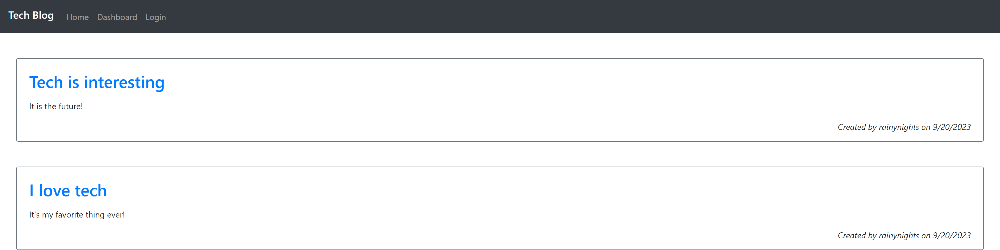

# Tech Blog

## Description

This is a blog site where developers can publish their blog posts and comment on other developers' posts as well.

## Table of Contents

* [Installation](#installation)

* [Usage](#usage)

* [License](#license)

* [Contributing](#contributing)

* [Tests](#tests)

* [Credits](#credits)

* [Questions](#questions)

## Installation

To install necessary dependencies, run the following command:

```bash
npm i
```

## Usage

Follow [this](https://guarded-depths-55102-13bfad643e7e.herokuapp.com/) link to open the application.

On opening the application, you will see the following page or similar:



From here, the user can view all posts as well as click on the titles to view the comments. In order to comment or create their own posts, users will have to login by clicking the "Login" button in the navigation bar. There, they can either login or signup. They will then be able to create their own posts, add their own comments, update posts they have created, and delete them.

## License

N/A

## Contributing

Feel free to contribute!

## Tests

You can use apps like Insomnia to test the api routes.

## Credits

N/A

## Questions

If you have any questions about the repo, open an issue or contact me directly at jbriseno2000@gmail.com. You can find more of my work at [jb6131](https://github.com/jb6131/).